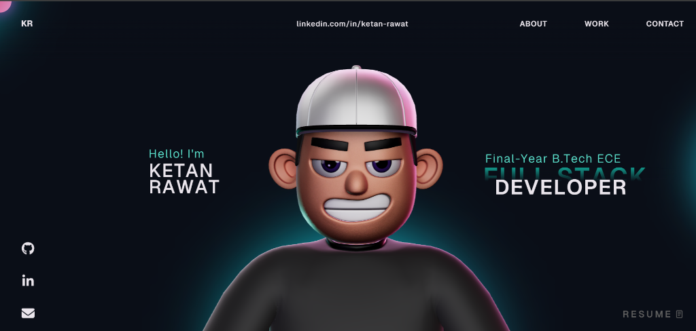

<div align="center">

# ⚡ Ketan Rawat — 3D Interactive Developer Portfolio

<p align="center">
  <b>A state-of-the-art 3D developer portfolio featuring interactive WebGL character scenes, Rapier physics-driven tech stack spheres, project showcases, and buttery smooth GSAP animations.</b>
</p>

[](https://react.dev/)
[](https://www.typescriptlang.org/)
[](https://threejs.org/)
[](https://vitejs.dev/)
[](https://gsap.com/)
[](https://opensource.org/licenses/MIT)

<br />



<br /><br />

**[🌐 View Live Portfolio](https://portfolio-ketan.onrender.com/) • [📄 Download Resume](https://portfolio-ketan.onrender.com/Ketan_Rawat.pdf)**

</div>

---

## 👨‍💻 About Me

I am **Ketan Rawat**, a final-year B.Tech student in **Electronics & Communication Engineering** at **National Institute of Technology (NIT) Jamshedpur** (2023–2027), aspiring to build high-impact systems as a **Full Stack Developer & Systems Engineer**.

- 🔭 **Focus Areas:** Scalable Web Architectures, Distributed Microservices, Event-Driven Streaming, Cryptographic Security, and 3D Web Experiences.
- 💡 **Key Stack:** React 18, TypeScript, Node.js, Express.js, Python, FastAPI, MongoDB, PostgreSQL, Redis, Apache Kafka, Docker, Supabase, Three.js / R3F.
- 🏆 **Hackathons:** National Finalist at Nothing Incubator 2025 (Top 15 / 10,450+ teams), ET AI Hackathon 2.0 Semi-Finalist, SupeRR Selector Additional Top 20, CreaTech 2026 Semi-Finalist, Adobe University Hackathon 2026 Round 1.

---

## ✨ Key Portfolio Features

- 🎭 **Interactive 3D WebGL Character:** Realistic lighting, ambient HDR environment reflections, and smooth head-tracking camera movement using `@react-three/fiber` & `@react-three/drei`.
- 🔮 **3D Physics Tech Stack Spheres:** 36+ bouncing physics spheres with dynamic, branded textures (Python, FastAPI, Kafka, Redis, Docker, PostgreSQL, React, etc.) rendered using `@react-three/rapier` rigid bodies colliding with mouse pointer physics.
- 🎠 **Project Showcase Carousel:** Smooth, responsive project slide deck showcasing real production dashboards, live deployment links, and GitHub repositories.
- 📜 **Achievements & Leadership Timeline:** Interactive timeline displaying national hackathons, university leadership roles, and academic achievements.
- 🎴 **Glassmorphic Contact Section:** Organized contact cards with direct email, phone, LinkedIn integrations, and downloadable PDF resume.
- ⚡ **Optimized Smooth Scrolling:** High-performance hardware-accelerated momentum scrolling via GSAP `ScrollSmoother` & `ScrollTrigger`.

---

## 🚀 Featured Projects

### 1. 🛡️ [SecureFlow](https://github.com/Ketanrawat2004/SecureFlow)
> **Enterprise Access Governance & Compliance Audit Platform**
- **Stack:** Python, FastAPI, React 18, TypeScript, PostgreSQL, Redis, Apache Kafka, Docker, NGINX
- **Live Demo:** [https://secureflow.duckdns.org](https://secureflow.duckdns.org)
- Zero-trust role-based access control (RBAC), multi-stage approval workflows, real-time audit logging via Kafka, and automated compliance policy verification.

### 2. 📝 [Pariksha · परीक्षा](https://github.com/Ketanrawat2004/pariksha-platform)
> **Cryptographic National Examination Integrity Platform**
- **Stack:** React, TypeScript, Supabase Realtime, TriShield Vault, AES-256-GCM, SHA-256, Razorpay
- **Live Demo:** [https://pariksha-platform.lovable.app](https://pariksha-platform.lovable.app)
- National examination platform built with cryptographic paper delivery, biometric proxy detection, live proctoring grid, and real-time exam integrity monitoring.

### 3. 🍱 [CampusBite](https://github.com/Ketanrawat2004/campusBite)
> **Event-Driven Microservices Campus Food Delivery Ecosystem**
- **Stack:** React, Node.js, Express.js, MongoDB, Redis, Apache Kafka, Docker Compose, Razorpay API
- **Live Demo:** [https://campusbite-jpwq.onrender.com/](https://campusbite-jpwq.onrender.com/)
- Campus food ordering system with smart group pooling (lowering delivery fees to ₹10–15), real-time kitchen queue metrics, and automated Kafka event updates.

### 4. 📚 [Bookztron](https://github.com/Ketanrawat2004/Bookztron)
> **Full-Stack MERN E-Commerce Web Application**
- **Stack:** React.js, Node.js, Express.js, MongoDB, JWT Authentication, Razorpay API, Netlify
- **Live Demo:** [https://bookztron-dev-branch.netlify.app/](https://bookztron-dev-branch.netlify.app/)
- Full-fledged book e-commerce platform with catalog filters, wishlist, cart management, address selection, JWT authentication, and Razorpay checkout.

---

## 🏆 Hackathons & Achievements

| Year | Hackathon / Challenge | Organization | Stage / Recognition |
| :---: | :--- | :--- | :--- |
| **2026** | **ET AI Hackathon 2.0** | The Economic Times & Unstop | **Semi-Finalist** |
| **2026** | **Careers of the Future Hackathon** | LIT School (Impact Entrepreneur Challenge) | **Grand Finalist** |
| **2026** | **CreaTech 2026** | Larsen & Toubro Limited (L&T) | **Semi-Finalist** |
| **2026** | **Adobe University Hackathon 2026** | Adobe | **Qualified Round 1 (Ongoing)** |
| **2026** | **HMEL Energy Quest 3.0** | HPCL-Mittal Energy Limited | **Qualified Round 2** |
| **2025** | **Nothing Incubator 2025** | Nothing Tech & Unstop | **National Finalist (Top 15 / 10,450+ Teams)** |
| **2024** | **SupeRR Selector Hackathon** | Rajasthan Royals & Unstop | **Top 20 Finalist (out of 7,500+)** |
| **2024–25** | **Soft Skills Club** | NIT Jamshedpur | **Creative Head & Event Director** |
| **2023–Now**| **NSS & Dramatics Society (Aahwan)** | NIT Jamshedpur | **Creative Member & Editor** |

---

## 🛠️ Complete Tech Stack

| Category | Technologies |
| :--- | :--- |
| **Languages** | Python, TypeScript, JavaScript, HTML5, CSS3, C/C++ |
| **Frontend** | React 18, Vite, Tailwind CSS, Three.js, React Three Fiber (R3F), GSAP |
| **Backend & APIs** | Node.js, Express.js, FastAPI, REST APIs, SSE (Server-Sent Events), WebSockets |
| **Databases & Cache** | MongoDB, PostgreSQL, Redis, Supabase (Realtime & RLS) |
| **DevOps & Cloud** | Apache Kafka, Docker, Docker Compose, NGINX, Linux, AWS, Vercel, Netlify |
| **Security & Auth** | JWT, Google OAuth 2.0, RBAC, AES-256-GCM, SHA-256, Razorpay Payments |
| **Core CS** | Data Structures & Algorithms, Object-Oriented Programming (OOP), MVC Architecture |

---

## 💻 Getting Started Locally

### Prerequisites
- Node.js (v18.0.0 or higher)
- npm (v9.0.0 or higher)

### Setup & Run
```bash
# 1. Clone the repository
git clone https://github.com/Ketanrawat2004/Portfolio_Ketan.git
cd Portfolio_Ketan

# 2. Install dependencies
npm install

# 3. Start development server
npm run dev

# 4. Build for production
npm run build

# 5. Preview production build locally
npm run preview
```

---

## 📬 Contact & Connect

- **Email:** [rawatketan06@gmail.com](mailto:rawatketan06@gmail.com)
- **Phone:** [+91 7489898361](tel:+917489898361)
- **LinkedIn:** [linkedin.com/in/ketan-rawat-97a8aa2a0](https://www.linkedin.com/in/ketan-rawat-97a8aa2a0/)
- **GitHub:** [github.com/Ketanrawat2004](https://github.com/Ketanrawat2004)
- **Location:** National Institute of Technology (NIT), Jamshedpur, India

---

<div align="center">
  <sub>Designed & Developed with ❤️ by <b>Ketan Rawat</b> • © 2026 All Rights Reserved</sub>
</div>
